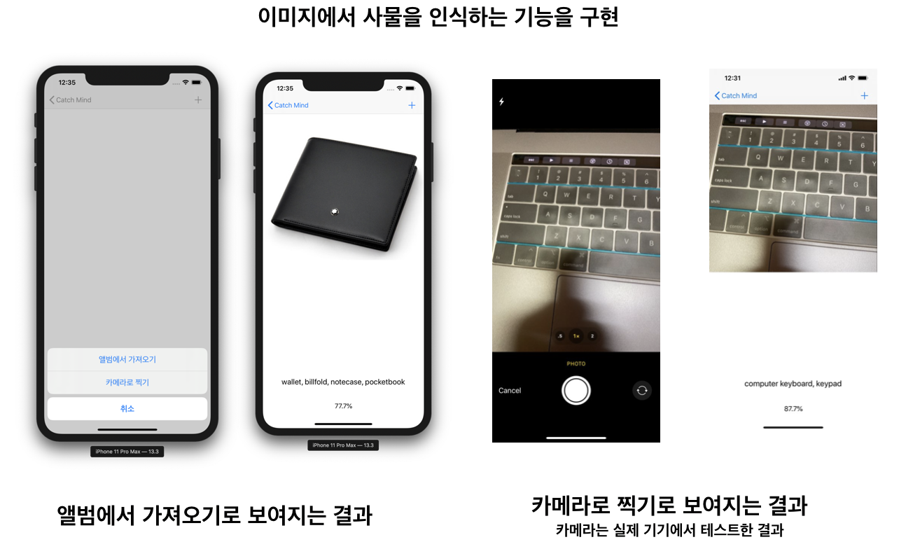
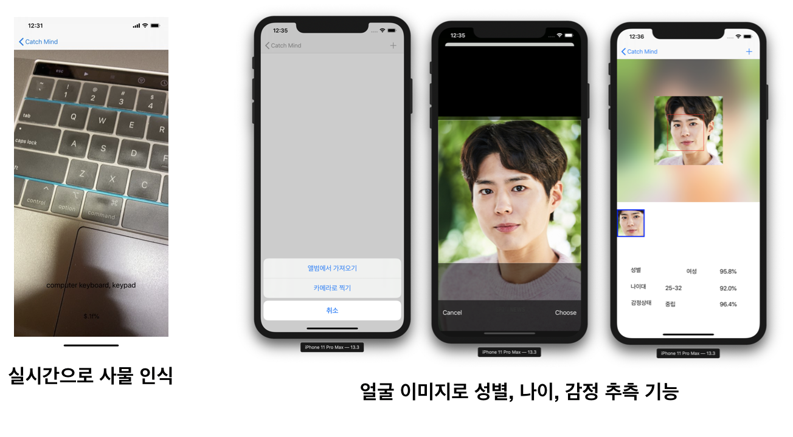

# CatchMind

- ML Model : Inceptionv3.mlmodel , AgeNet.mlmodel , CNNEmotions.mlmodel , GenderNet.mlmodel 활용
( 모델은 크기가 커서 빠져있음.) 
- VideoCapture : VideoCameraType.swift , VideoCapture.swift , AVCaptureDevice+Extension.swift 
( code는 가져와서 활용함.)

### 소개
머신 러닝을 활용하여 간단한 앱 구현
iOS 11에 새로 추가된 Core ML과 Vision 프레임워크를 활용

### 주요 기능 
- 이미지에서 사물을 인식하는 기능을 구현 - Core ML
- 실시간으로 사물 인식 - Core ML
- 얼굴 이미지로 성별, 나이, 감정 추측 기능 
- 얼굴 인식 - Vision Framework

### 화면

